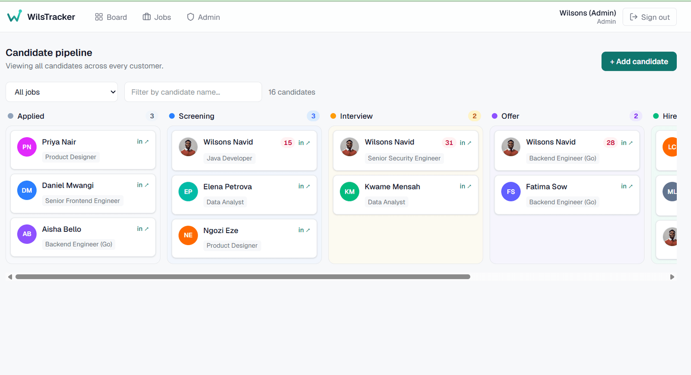

# WilsTracker

<p align="center">
  
  
  
  
  
  
  
  
  <a href="https://github.com/Wilsons-Navid/Wilstracker/actions/workflows/ci.yml"></a>
</p>

WilsTracker is a lightweight applicant tracking system (ATS). Admins create
accounts, customers post jobs and manage their hiring pipeline on a drag-and-drop
Kanban board, and candidates apply through a public careers site and track their
applications in their own portal. An AI-assisted CV assessment scores each
applicant against the job they applied for.

Live: [wilstracker.vercel.app](https://wilstracker.vercel.app)

<p align="center">
  
</p>

It was built as a one-week coding test, with the goal of getting a first
customer live quickly on a clean, well-documented codebase, then extended with a
full candidate experience, richer recruiter tools, and a layout that works just
as well on a phone.

## Table of contents

1. [What we're building](#what-were-building)
2. [Core features](#core-features)
3. [Tech stack](#tech-stack)
4. [Architecture and security](#architecture-and-security)
5. [Data model](#data-model)
6. [Project layout](#project-layout)
7. [Getting started](#getting-started)
8. [Environment variables](#environment-variables)
9. [Scripts](#scripts)
10. [Documentation](#documentation)
11. [Assumptions](#assumptions)

## What we're building

A focused ATS for small recruiting teams, with a candidate side bolted on so
applicants are first-class users rather than rows in someone else's database. The
design follows what makes recruiters productive (see
[`docs/ATS-RESEARCH.md`](docs/ATS-RESEARCH.md)):

- Speed and low click-count. Moving a candidate is a single drag.
- A visual pipeline instead of spreadsheets, so the Kanban board is the home screen.
- Candidate data stays clean, with the CV file and LinkedIn always one click away.
- A light AI assist that scores fit against the job. It is advisory only.
- Quick to adopt, so a customer can be live the same day.

Three roles share one codebase. Admins create and manage accounts and can act on
any customer's behalf. Customers manage their own jobs and pipeline. Candidates
apply to roles and follow their own applications.

## Core features

### The original brief

Where the project started:

- Admins provision every recruiter and admin login. There is no public sign-up for them.
- Recruiters sign in to their own workspace.
- They post the roles they are hiring for.
- They add candidates by hand and capture the essentials, such as a name, an email, and a LinkedIn link.
- Each recruiter's candidates land on one compact Kanban board, grouped by stage across all of that recruiter's jobs.
- The board narrows by job and by candidate name when the pipeline gets busy.
- Admins can do all of this for any recruiter, through the same screens rather than a separate path.

### The candidate experience

The candidate side was added on top of the brief:

- A public landing page is the front door, with links to open roles, sign in, and sign up.
- A public careers page lists every open role, each with its own detail page.
- Candidates can self-register for a candidate account (recruiters and admins stay admin-created).
- Applying requires a candidate account. A signed-out visitor who clicks apply is sent to sign in or sign up and returned to the same job afterwards.
- Each candidate has a portal that shows their applications with a stage progress track, plus a profile they can edit and a résumé they can replace.
- If a job has custom questions, they appear on the apply form and the candidate's answers travel with the application.
- The candidate's photo shows on their portal home, with coloured initials as a fallback.
- Candidates receive email notifications when they apply and when their application changes stage.

### Additional capabilities

Built on top of both sides:

- **AI CV assessment:** Claude scores an application against the job and returns a structured result with a numeric score, a breakdown, strengths, gaps, and a recommendation. It scores the résumé's extracted text rather than re-sending the file each time, which keeps it fast and cheap. The score also rides along on the Kanban card, colour-coded, so a recruiter can scan a column and see who to look at first. It is advisory only and never auto-rejects anyone.
- **Automatic CV text extraction:** when a résumé is uploaded its text is pulled out on the server, `unpdf` for PDF and `mammoth` for DOCX, and stored next to the file. The candidate page shows both the original document and the extracted text, which a recruiter can edit if a parse comes out rough.
- **Editable jobs and a manage page:** every job has its own manage page where the owner, or an admin, edits the description, curates the custom questions, and shares the role.
- **Custom application questions:** a job can carry free-text and multiple-choice questions. They render on the apply form and the answers surface on the candidate, so the screening criteria live with the role.
- **Job sharing:** an open role can be shared straight to X, LinkedIn, Facebook, WhatsApp, Telegram, or email, each with its own branded button.
- **Admin account management:** admins create and edit accounts, including an optional description and location for a customer, reset a password, and deactivate or reactivate accounts, all behind confirmation prompts. Promoting someone to admin means retyping their email to confirm, and an admin can neither demote nor deactivate themselves. The accounts list filters by search, role, and location.
- **Candidate accounts:** candidates who self-register appear in the same admin list, counted and badged by role. An admin can open a candidate account to see their profile and every application they have filed, mirroring the candidate's own portal view.
- **Password reset:** a customer or candidate can reset their own password from a "forgot password" link, and an admin can set a new password for any account from the admin panel.
- **Consistent branding:** the WilsTracker logo runs across the app, the candidate portal, the public pages, the login and sign-up screens, the favicon, and every transactional email.
- **Résumé and avatar storage:** files live privately in Supabase Storage and are served through short-lived signed URLs that check ownership first. Candidates manage their own photo; recruiters can see it but not change it.
- **A decoupled data model:** the person and the pipeline entry are separate, so one person can apply to several jobs, and every stage change is recorded in an audit trail.
- **Works on mobile:** the board, forms, and navigation adapt down to phone screens: the top nav folds into a menu, and the Kanban scrolls with a swipe while a press-and-hold moves a card.

## Tech stack

| Layer | Choice |
|---|---|
| Framework | Next.js 16 (App Router, Server Components, Server Actions, `proxy.ts`) |
| Language | TypeScript, React 19 |
| Backend | Supabase (Postgres, Auth, Row Level Security, Storage) |
| Styling | Tailwind CSS v4 |
| Icons | lucide-react, plus inline brand SVGs for social sharing |
| Drag and drop | @dnd-kit |
| AI | Anthropic Claude (structured tool-use output, scores extracted text) |
| Document parsing | `unpdf` (PDF) and `mammoth` (DOCX) extract résumé text for display and the assessment |
| Email | Resend (HTTP API, optional) |
| Hosting | Vercel (functions pinned to the database's region) |

## Architecture and security

- **Roles:** each profile has a role of `admin`, `customer`, or `candidate`, stored on `profiles.role`. The role drives routing: a customer or admin lands on the board, a candidate lands on their portal.
- **Roles come from admins, not applicants:** a new account's role is read from service-role-only `app_metadata`, never from the values a visitor can set on the public sign-up form, so self-registration can only ever create a candidate.
- **Row Level Security:** every table has RLS. Customers only see rows they own through `owner_id = auth.uid()`. Candidates only see their own person row and their own applications, and can never read assessments, notes, or stage history. Admins pass an `is_admin()` check and can see everything.
- **No policy recursion:** the candidate and application policies reference each other, so the cross-table checks run through `SECURITY DEFINER` helper functions (`user_owns_candidate`, `is_my_application`) that bypass RLS and avoid an infinite-recursion error.
- **Three Supabase clients for three trust levels:**
  - `lib/supabase/client.ts` is the browser client (anon key) and runs under RLS.
  - `lib/supabase/server.ts` is the server client bound to the user's session and also runs under RLS.
  - `lib/supabase/admin.ts` is the service-role client that bypasses RLS. It imports `server-only`, so the build fails if it is ever pulled into browser code.
- **Authorize, then act:** a privileged server action first checks access through the user-scoped client, where RLS makes the decision, and only then uses the service-role client for the storage or write operation. A signed résumé URL is generated from the candidate row the caller is proven to own, never from a path passed in by the caller.
- **Identity from the session, not the form:** applying takes the candidate identity from the signed-in session rather than an email field, so an application cannot be filed against someone else or used to overwrite their profile.
- **Deactivation is enforced everywhere:** disabling an account bans it at the auth layer and makes `getProfile` return null, so the user is signed out and blocked from acting, while the row is kept for a later reactivation rather than deleted.
- **Functions sit next to the data:** the serverless functions are pinned to the database's region, so the handful of small queries each request makes don't cross an ocean on the way to Postgres.

## Data model

The person (`candidates`) is separate from the pipeline entry (`applications`),
so the same person can apply to multiple jobs and each application moves through
the pipeline on its own.

| Table | Key columns | Purpose |
|---|---|---|
| `profiles` | `id -> auth.users`, `full_name`, `role`, `active`, `description`, `location`, `created_by` | identity, role, customer details (description, location), and whether the login is enabled |
| `jobs` | `id`, `owner_id -> profiles`, `title`, `description`, `location`, `status` | postings |
| `candidates` | `id`, `auth_user_id -> auth.users`, `full_name`, `email`, `phone`, `linkedin_url`, `portfolio_url`, `location`, `headline`, `resume_url`, `resume_text`, `avatar_url` | the person |
| `applications` | `id`, `candidate_id -> candidates`, `job_id -> jobs`, `owner_id -> profiles`, `stage`, `status`, `source`, `notes`, `applied_at` | one candidate applying to one job |
| `job_questions` | `id`, `job_id -> jobs`, `prompt`, `kind`, `options`, `position`, `required` | custom free-text or multiple-choice questions on a job |
| `application_answers` | `id`, `application_id -> applications`, `question_id -> job_questions`, `answer` | a candidate's answers to those questions |
| `stage_history` | `id`, `application_id -> applications`, `from_stage`, `to_stage`, `moved_by`, `moved_at` | stage movement audit |
| `cv_assessments` | `id`, `application_id -> applications`, `score`, `summary`, `strengths`, `gaps`, `recommendation`, `raw_json` | AI feature |

## Project layout

```
src/
  app/
    (app)/             # customer + admin routes: board, jobs (+ per-job manage page), candidates, admin (+ candidate account view)
    portal/            # candidate portal: applications and profile
    careers/           # public careers list, job detail, apply
    auth/callback/     # email confirmation / PKCE code exchange
    login/  signup/    # auth pages
    actions/           # server actions: auth, jobs, job-questions, candidates, apply, ai, resume, avatar, admin, candidate-profile
    page.tsx           # role-aware landing page
  components/          # board, careers, portal, candidate forms, job tools (edit, questions, share), admin (accounts table, create/edit), uploads, auth, ui (incl. logo)
  lib/
    supabase/
      client.ts        # browser client (anon key)
      server.ts        # server client (user session)
      admin.ts         # service-role client (server only)
    dal.ts             # getProfile / requireStaff / requireAdmin / requireCandidate / getCandidate
    extract.ts         # résumé text extraction (unpdf / mammoth) and caching
    uploads.ts         # résumé and avatar validation and storage helpers
    site.ts            # request-origin helper for share links
    email.ts           # Resend notifications (optional, no-op without a key)
    types.ts           # shared types mirroring the DB
  proxy.ts             # session refresh and route guard (Next 16 "middleware")
supabase/
  schema.sql           # full target schema: tables, RLS, triggers
  migrations/          # incremental migrations (candidate portal, RLS fixes, secure roles, job questions, account status, customer profile fields)
  verify_rls.sql       # RLS assertion matrix
scripts/
  setup-storage.mjs    # create the Storage buckets
  seed-demo.mjs        # seed a demo admin, customers, jobs, and applications
docs/                  # PLAN, research, setup
```

## Getting started

See [`docs/SETUP.md`](docs/SETUP.md) for the full walkthrough. The short version:

```bash
# 1. Install
npm install

# 2. Configure env
cp .env.local.example .env.local   # then fill in your Supabase and Anthropic keys

# 3. Database and storage
#    Run supabase/schema.sql in the Supabase SQL editor, then:
node scripts/setup-storage.mjs     # create the resumes and avatars buckets

# 4. Create the first admin (see SETUP step 6), then run:
npm run dev                        # http://localhost:3000
```

For an existing database, apply the files in `supabase/migrations/` in order
instead of re-running the full schema.

## Environment variables

| Variable | Purpose |
|---|---|
| `NEXT_PUBLIC_SUPABASE_URL` | Supabase project URL |
| `NEXT_PUBLIC_SUPABASE_ANON_KEY` | Public anon key (browser and server, RLS-bound) |
| `SUPABASE_SERVICE_ROLE_KEY` | Secret service-role key, used only on the server |
| `ANTHROPIC_API_KEY` | Claude API key for the CV assessment |
| `RESEND_API_KEY` | Resend key for candidate emails (optional, emails are skipped when unset) |
| `RESEND_FROM` | From address for those emails (optional) |

`.env.local` is gitignored and is never committed.

## Scripts

| Command | What it does |
|---|---|
| `npm run dev` | Start the dev server |
| `npm run build` | Production build |
| `npm run start` | Run the production build |
| `npm run lint` | Lint |
| `node scripts/setup-storage.mjs` | Create the Storage buckets |
| `node scripts/seed-demo.mjs` | Seed demo data |

## Documentation

- [`docs/REVIEW.md`](docs/REVIEW.md) is a quick reviewer's tour: demo logins, a five-minute walkthrough, and where the interesting code lives.
- [`docs/PLAN.md`](docs/PLAN.md) covers the build plan, data model, and schedule.
- [`docs/ATS-RESEARCH.md`](docs/ATS-RESEARCH.md) explains the research behind the feature and design choices.
- [`docs/SETUP.md`](docs/SETUP.md) walks through the environment setup step by step.

## Assumptions

- Self-serve signup is enabled for the candidate role only. Recruiter and admin accounts stay admin-created, which matches the original brief.
- The person and the pipeline entry are separate, so one candidate can hold several applications across different jobs.
- Applying requires a candidate account, so every application is verified and trackable from the portal.
- The pipeline stages are fixed for the MVP. Custom per-job stages are future work.
- Custom application questions are optional and per-job. A job with none simply shows the standard apply form.
- One customer maps to one recruiting organization (a single-user tenant) for the MVP.
- The AI assessment is advisory. It never auto-rejects a candidate.
- Deactivating an account blocks it but keeps the data, so the action is reversible. Accounts are not hard-deleted.
- Email notifications are best-effort through Resend and degrade to a no-op when no key is configured.
- **Future action: email deliverability.** Without a verified sending domain, Resend only delivers to the account owner's own address. Verifying a domain in Resend and setting `RESEND_FROM` to an address on it would let notifications reach any candidate or customer. The app code is already wired for this; only the domain and `RESEND_FROM` are outstanding.
